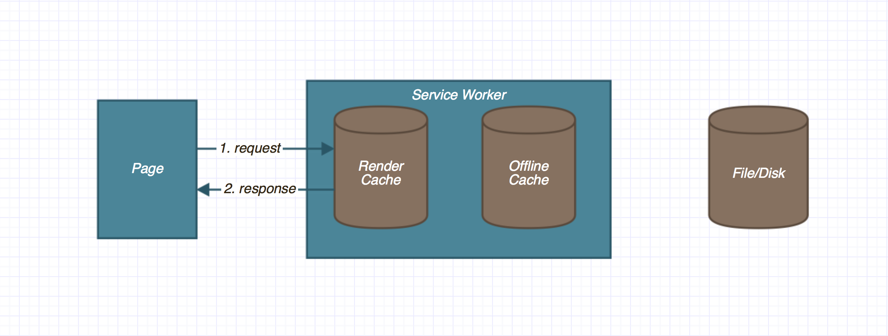

# V3 Architecture

Web-apps aren't as fast as they could be. We're building large fragile single-threaded applications that can't leverage the full power of the device they're running on. It's difficult for newcomers to digest the scope of an application and regressions are easy to introduce.

This v3 architectural proposition flips today's web-application development model on its head. Using bleeding edge web-technologies and approaching the problem form an angle that better suits the constraints of our platform.

## New Concepts:
1. **Offline caching** assets using Service Worker (js, html, css, images, etc).
2. **Caching rendered content** for fast subsequent page loads.
3. **Storing content in the cloud** to allow it to be used across devices.
4. **Delta updates** can be applied without restart.
5. **Swappable parts** for partner/developer customization and A-B testing.
6. **Forced encapsulation** via multiple documents and workers to help prevent regressions and provide consistent architecture across the OS.
7. **Multi threaded architecture** to leverage multiple cores to maximise performance.
8. **Macro memory management** shutting down parts of an application to free up resources.

## Offline caching

In the current version of *FirefoxOS* we depend on 'packaged' apps served locally on the device to provide an offline experience. This is a proprietary approach, that misses search engine discovery, deep linking, and automatic updates; arguably some of the main strengths of the web.

*ServiceWorker* is close to shipping in Gecko. Learning from the mistakes of *AppCache* It gives web applications complete control over managing its resources to provide a fully tailored offline experience.

With *ServiceWorker* we believe *FirefoxOS* app can join the web and provide a truly unique OS experience, where apps don't live on one device, but everywhere.

## Storing content in the cloud

With apps breaking free from the device to the web, it makes sense for your content to do the same. If both your apps and you content can be access from anywhere, so can your OS.

We're proposing that users can assign third-party cloud storage services (*Dropbox*, *Drive*, *Box*, etc) to their *Firefox Account* and provide an interface to allow apps to store and retrieve content.

## Caching rendered content

Caching assets via a *ServiceWorker* is one way to speed up page loads; another would be to cache the actual HTML content.

Apps rendered on the client are done so using Javascript. The first time a particular view loads the HTML will be templated from data fetched from a worker. Once rendering has completed the view will send the entire HTML of the page to the *ServiceWorker* to cache it.

Next time this document is requested the request will be fulfilled immediately from the 'render cache' without having to hit the network, request data, or render HTML.



## Swappable Parts

```
{
  'view.html': 'http://google.com',
  'imgs/icons/*': 'telfonica.com/icons/*'
}
```

```
{
  'components/gaia-header/gaia-header.js': 'http://github.com/wilsonpage/gaia-header/v2/gaia-header.js'
}
```

## Forced encapsulation

Our proposition is built around encapsulated 'modules'. These 'modules' can come in the form of front-end documents (views) and back-end workers (servers). The goal for developers to be able to hack on single part of an app without having to know how the rest of it works.

Each view within an app would become its own HTML document. Parent documents would arrange these views into a layout suitable for the device's screen-size. This is good from a performance standpoint as we have enforced reflow boundaries.

Just like a traditional client/server model, each view will request its data from a corresponding worker. The interface between views and workers is agreed in advance via a 'contract', we refer to this communication channel as a 'bridge'.

## Multi-threaded architecture

Reduced regressions and narrower development scope are not the only advantages. Moving to multiple documents and workers enables us to spread app logic across multiple threads. This enables a single app to better leverage the power of the device it's running on.

## Macro memory management

Right now our apps run in a single runtime, the window. All the memory our application uses is associated with this window. When an app is sent the the background we can't free up any of this memory unless the entire app is closed. Gradually the devices resources are consumed and performance suffers.

Spreading applications across multiple documents and workers we're able to break our apps down into smaller chunks. When an app runs these chunks can be switched on when needed and switched-off when they're not. This opens up exciting prospects for memory management, and thus a more performant platform.

## Conclusion

The dawn the *Service Worker* will shift how web-applications are authored. It is good timing to pitch a new approach to web-app development; an approach that gives the web its best shot at competing with native.

